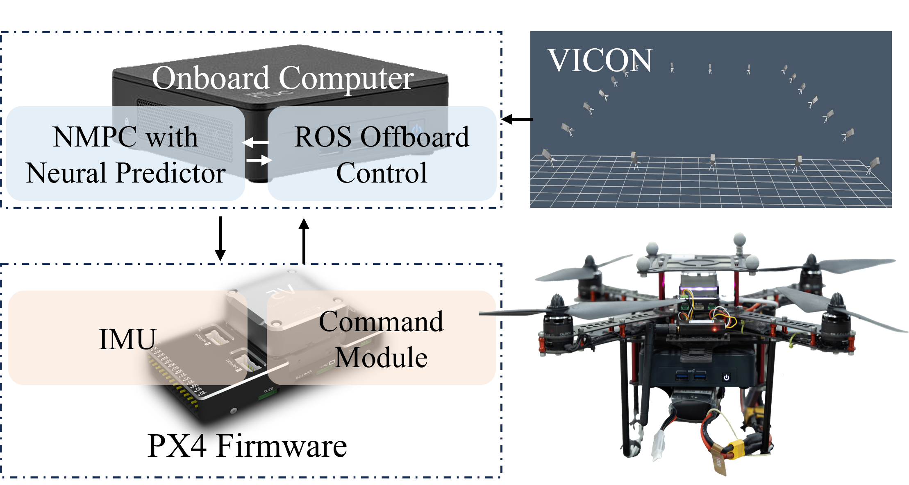

# Neural Predictor for Flight Control with Payload

This repo contains the implementation of the paper "Neural Predictor for Flight Control with Payload" by Ao Jin, Chenhao Li, Qinyi Wang, Ya Liu, Panfeng, Huang and Fan Zhang*.

The ***Neural Predictor***  is a learning-based scheme to capture force/torque caused by payload and residual dynamics of tethered-UAV system. Specifically, inspired by DDKO theory, the formulation of lifted linear system (LLS) is derived and the LLS is learned from data to capture the force/torque caused by payload and residual dynamics of tethered-UAV system. The learned dynamics combined with nominal dynamics, which produces a hybrid model of tethered-UAV system. This hybrid model is incorporated into a model predictive control framework, known as ***NP-MPC***. We demonstrate that our proposed framework not only provides much better prediction of external force and torque against state-of-the-art learning-based estimator, but also improve closed-loop performance in both simulations and real-world flight significantly.


## 1. Getting Started

Before running the code, install the dependency packages in a virtual python env by executing the following command:

```bash
pip install requirements.txt
```

## 2. Running the Code

This repo includes the code of two parts: **Numerical Evaluation** and **Physical Experiments**.

### 2.1 Numerical Evaluation

* Processing BEM data
  
  The dataset for training and testing in this work is adopted from BEM dataset. For sake of convenience, we provided BEM dataset in the `data` folder. Navigate to the `data/BEM` folder, run `python process_data.py` , then some figures and files will appear in the `data/BEM` folder

* Training LLS
  
  Run `bash scripts/train.sh` and this will take a couple minutes (The training time on i9-12900H CPU was around 8 min, and training time on a RTX 3060 laptop GPU was around 5 min). After training, the trained LLS will be located in the `dump/evaluation` folder.  

* Evaluation Neural Predictor
  
  Run `bash scripts/evaluation.sh`. The validation results on 13 unseen trajectories will be located in `dump/evaluation/test`. In each trajectory folder, there are two figures that show the prediction results of Neural Predictor. **In addition, the RMSE results on 13 unseen trajectories are shown in `dump/evaluation/rmse_result.csv`**, which corresponds the results of Table I in the paper.

* Plot
  
  Navigate to the `plot` folder. The `BEM_Comparasion` subfolder corresponds the result of Fig. 2 presented in paper. The `Sample_Efficiency` subfolder corresponds the result of Fig. 3 presented in paper.

### 2.2 Physical Experiments

We evaluate the Neural Predictor in the real-world experiments. The setup for real-world flight experiments is illustrated in Section VI.B of the paper. 

<div align="center">
    
</div>

Code: Coming soon

## 3. Citation

If you find this repo useful in your research, please cite our work:
